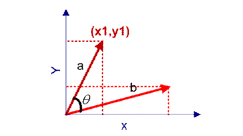

### 余弦相似度算法
* 本文目前将该算法应用于网页标题合并和标题聚类中，目前仍在尝试应用于其它场景中。

优点：计算结果准确，适合对短文本进行处理。

缺点：需要逐个进行向量化，并进行余弦计算，比较消耗CPU处理时间，因此不适合长文本，如网页正文、文档等。

* 余弦距离，也称为余弦相似度，是用向量空间中两个向量夹角的余弦值作为衡量两个个体间差异的大小的度量。

* 余弦值越接近1，就表明夹角越接近0度，也就是两个向量越相似，这就叫"余弦相似性"。

* 三角形的余弦计算公式为：
$$
\cos(\theta) = \frac{ a^2 + b^2 - c^2 }{ 2ab }
$$

* 在向量表示的三角形中，假设a向量是（x1, y1），b向量是(x2, y2)，那么可以将余弦定理改写成下面的形式：
  
  
* 向量a和向量b的夹角 的余弦计算如下：
  $$
  \cos(\theta) = \frac{ a \times b }{ ||a|| \times ||sb||  }\\
                = \frac{(x_1, y_1)\times(x_2 , y_2)}{\sqrt{x_1^2 + y_1^2}\times\sqrt{x_2^2 + y_2^2}}\\
                = \frac{x_1\times yx_2 + y_1\times y_2}{\sqrt{x_1^2 + y_1^2}\times\sqrt{x_2^2 + y_2^2}}
  $$
  
* 扩展，如果向量a和b不是二维而是n维，上述余弦的计算法仍然正确。假定a和b是两个n维向量，a是  ，b是  ，则a与b的夹角 的余弦等于：
$$
  \cos(\theta) = \frac{ \sum_{i=1}^n{x_i \times y_i}}{\sqrt[2]{\sum_{i=1}^n{x_i^2}} \times \sqrt[2]{\sum_{i=1}^n{y_i^2}}}\\
  = \frac{a \times b}{||a|| \times ||b||}
$$

* 举例说明
  * 句子A：这只皮靴号码大了。那只号码合适
  * 句子B：这只皮靴号码不小，那只更合适

  * 怎样计算上面两句话的相似程度？

    * 基本思路是：如果这两句话的用词越相似，它们的内容就应该越相似。因此，可以从词频入手，计算它们的相似程度。

    * 第一步，分词。
      * 句子A：这只/皮靴/号码/大了。那只/号码/合适。
      * 句子B：这只/皮靴/号码/不/小，那只/更/合适。
      
    * 第二步，列出所有的词。  
      * 这只，皮靴，号码，大了。那只，合适，不，小，很    
    * 第三步，计算词频。    
      * 句子A：这只1，皮靴1，号码2，大了1。那只1，合适1，不0，小0，更0  
      * 句子B：这只1，皮靴1，号码1，大了0。那只1，合适1，不1，小1，更1    
    * 第四步，写出词频向量
      * 句子A：(1，1，2，1，1，1，0，0，0)
      * 句子B：(1，1，1，0，1，1，1，1，1)

  * 到这里，问题就变成了如何计算这两个向量的相似程度。我们可以把它们想象成空间中的两条线段，都是从原点（[0, 0, ...]）出发，指向不同的方向。两条线段之间形成一个夹角，如果夹角为0度，意味着方向相同、线段重合,这是表示两个向量代表的文本完全相等；如果夹角为90度，意味着形成直角，方向完全不相似；如果夹角为180度，意味着方向正好相反。因此，我们可以通过夹角的大小，来判断向量的相似程度。夹角越小，就代表越相似。
  > 计算两个句子向量
  > 句子A：(1，1，2，1，1，1，0，0，0)
  > 和句子B：(1，1，1，0，1，1，1，1，1)的向量余弦值来确定两个句子的相似度。
  
$$
  \cos(\theta) = \frac{1 \times 1 + 1 \times 1 +2 \times 1 + 1 \times 0 +1 \times 1 + 1 \times 1 +0 \times 1 + 0 \times 1 +0 \times 1 }{\sqrt{1^2+1^2+2^2+1^2+1^2+1^2+0^2+0^2+0^2} \times \sqrt{1^2+1^2+1^2+0^2+1^2+1^2+1^2+1^2+1^2}}\\
  = 0.81
$$