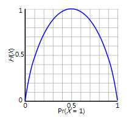

### 机器学习中的词语解释
#### 什么是墒？
&nbsp;　　在信息论中，熵是对不确定性的测量，熵越高，则能传输越多的信息；熵越低，则意味着传输的信息越少。熵度衡量系统的不确定性，当对某个系统的知识缺乏的时候，其中的不确定性也会随着增加。
&nbsp;　　例如抛硬币，在理想的情况下是无法预测出现正面还是反面，此时熵达到最大。但是对于“明天太阳从东方升起”，完全可以依靠目前的只是，预测该事件肯定会发生，信息熵最小。对应的计算公式（只包含一个随即变量）如下所示：
&nbsp;　　香农给出了熵数学表达：某个事件用随机变量X表示，其可以的取值{x1, x2, ...xn }，则该事件的信息熵定义为:
        $$    
    H(X) = E(I(X))
    $$
&nbsp;　　其中I(X)，表示随机变量的信息，I(X)一般定义为：
    $$
    I(X = x_i) = -\log_2{p(x_i)}
    $$
&nbsp;　　那么，熵的定义为：
    $$
    H(X) = \sum_{i=1}^n{p(x_i)I(x_i)} = - \sum_{i=1}^n{p(x_i)\log_b{p(x_i)}}
    $$
&nbsp;　　下图给出了二分类问题熵函数：

