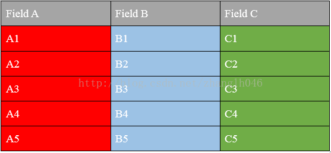

### Hive知识点
#### HiveServer2
* 开启Hive服务，用于远程操作，一般用于JDBC/ODBC
* 其中JDBC的操作跟操作mmysql数据库类似(使用JDBC连接之前一定要先启动hiveserver2
)

#### Hive数据压缩
* 常见的压缩(压缩格式: bzip2, gzip, lzo, snappy等
)
    * 压缩比：bzip2>gzip>lzo bzip2最节省存储空间
    * 解压速度：lzo>gzip>bzip2 lzo解压速度是最快的
* 四种压缩对比

|压缩格式|split|native|压缩率|速度|是否hadoop自带|linux命令|换成压缩格式后，原来的应用程序是否要修改|
|:----:|:----:|:----:|:----:|:----:|:------:|
|gzip|否|是|很高|比较快|是，直接使用|有|和文本处理一样，不需要修改|
|lzo|是|是|比较高|很快|否，需要安装|有|需要建索引，还需要指定输入格式|
|snappy	|否|是|比较高|很快|否，需要安装|没有|和文本处理一样，不需要修改|
|bzip2|是|否|最高|慢|是，直接使用	|有|和文本处理一样，不需要修改|


#### Hive数据存储

* 数据文件的是存储主要有以下几种：
    * Avro (Hive 0.9.1 and later)
    * ORC (*) (Hive 0.11 and later)
    * RegEx
    * Thrift
    * Parquet (*) (Hive 0.13 and later)
    * CSV (Hive 0.14 and later)
    * JsonSerDe (Hive 0.12 and later in hcatalog-core)

* 什么是行式存储和列式存储？
    * 现在有一张表，如图所示：
    
    
    * 行式存储，如下所示：
    

    * 列式存储，如下所示：
    

* 行式存储和列式存储的比较

||行式存储|
|:-----:|:-----:|
|优点|相关的数据是保存在一起、一行数据就是一条记录|
||这种存储格式比较方便进行INSERT/UPDATE操作|
|缺点|如果查询几个字段，会查询整行数据，当数据大的时候影响性能|
||由于列的数据类型不一致，很难获得一个极高压缩比|
||不是所有的列都适合做索引

 ||列式存储|
|:-----:|:-----:|
|优点|查询时，只查询相关列，不会把所有列都查询出来，可跳过不必要的列查询|
||高效的压缩率，不仅节省储存空间也节省计算内存和CPU|
||任何列都可以作为索引|
|缺点|INSERT/UPDATE很麻烦或者不方便|
||不适合扫描小量的数据|

* 几种文件存储格式比较

|文件存储格式|存储方式|性能|描述|
|:----:|:----:|:----:|:----:|
|textfile(默认格式)|行存储|磁盘开销大 数据解析开销大|压缩的text文件 hive无法进行合并和拆分|
|sequencefile|行存储|可分割 压缩|二进制文件,以<key,value>的形式序列化到文件中|
||||优势是文件和Hadoop api中的mapfile是相互兼容的|
|rcfile|数据按行分块 每块按照列存储|压缩快 快速列存取|读记录尽量涉及到的block最少|
||||读取需要的列只需要读取每个row group 的头部定义|
||||读取全量数据的操作 性能可能比sequencefile没有明显的优势|
|orc|数据按行分块 每块按照列存储|压缩快 快速列存取|效率比rcfile高,是rcfile的改良版本|
|Parquet|列式存储||设计动机是存储嵌套式数据，比如Protocolbuffer，thrift，json等|
|自定义|||用户可以通过实现inputformat和 outputformat来自定义输入输出格式|

* 总结：
    * textfile 存储空间消耗比较大，并且压缩的text 无法分割和合并 查询的效率最低,可以直接存储，加载数据的速度最高
    * sequencefile 存储空间消耗最大,压缩的文件可以分割和合并 查询效率高，需要通过text文件转化来加载
    * rcfile 存储空间最小，查询的效率最高 ，需要通过text文件转化来加载，加载的速度最低

#### Hive的优化
* 通过配置FetchTask
* 通过*EXPLAIN*查看执行计划
* 大表拆分
* 大表【拆分】
    * 子表
* 外部表、分区表
    * 结合使用
    * 多级分区
* 数据
    * 存储格式（textfile、orcfile、parquet）
    * 数据压缩（snappy）
* SQL
    * 优化SQL语句
    * join，filter
* MapReduce
    * Reduce Number
    * JVM重用
    * 推测执行

* Join
    * Common/Shuffle/Reduce Join
 	* 连接发生的阶段，发生在 Reduce Task
 	* 大表对大表
 	* 每个表的数据都是从文件中读取的

    * Map Join
 	* 连接发生的阶段，发生在 Map Task
 	* 小表对大表
 	* 大表的数据放从文件中读取 cid
 	* 小表的数据内存中 id
 	* DistributedCache

    * SMB Join
 	* Sort-Merge-BUCKET Join

#### Hive使用案例

##### UDF编写
* 编写UDF函数

```java
package com.beifeng.senior.hive.udf;

import java.text.SimpleDateFormat;
import java.util.Date;
import java.util.Locale;
import org.apache.hadoop.hive.ql.exec.UDF;
import org.apache.hadoop.io.Text;

/**
 * 1. Implement one or more methods named "evaluate" which will be called by Hive.
 * 2. "evaluate" should never be a void method. However it can return "null" if needed
 *
 */
public class DateTransformUDF extends UDF {

	private final SimpleDateFormat inputFormat = new SimpleDateFormat("dd/MMM/yyyy:HH:mm:ss", Locale.ENGLISH);
	private final SimpleDateFormat outputFormat = new SimpleDateFormat("yyyyMMddHHmmss");
	/**
	 * 31/Aug/2015:00:04:37 +0800
	 * 2015083100043
	 * @param str
	 * @return
	 */
	public Text evaluate(Text input) {
		Text output = new Text();
		// validate
		if (null == input) {
			return null;
		}
		String inputDate = input.toString().trim();
		if(null == inputDate){
			return null ;
		}
		try{
			// parse
			Date parseDate = inputFormat.parse(inputDate);
			//transform
			String outputDate = outputFormat.format(parseDate)
			// set
			output.set(outputDate);		
		}catch(Exception e){
			e.printStackTrace();
			return output ;
		}
		
		return output;
	}	 
}

```

* 打包成jar包
* 添加jar
    * add jar /opt/datas/hiveudf2.jar ;
* 创建函数
    * create temporary function my_removequotes as "com.beifeng.senior.hive.udf.RemoveQuotesUDF" ;
* 加载数据

    ```shell
    insert overwrite table default.bf_log_comm 
        select 
            my_removequotes(remote_addr), 
            my_removequotes(time_local), 
            my_removequotes(request), 
            my_removequotes(http_referer) 
        from    
    default.bf_log_src ;
    ```


##### 使用python脚本
* 创建表

```shell
CREATE TABLE u_data_new (
  userid INT,
  movieid INT,
  rating INT,
  weekday INT)
ROW FORMAT DELIMITED FIELDS TERMINATED BY '\t';
```

* 编写python脚本

```python
import sys
import datetime

for line in sys.stdin:
  line = line.strip()
  userid, movieid, rating, unixtime = line.split('\t')
  weekday = datetime.datetime.fromtimestamp(float(unixtime)).isoweekday()
  print '\t'.join([userid, movieid, rating, str(weekday)])
```

*  加载数据

```shell
INSERT OVERWRITE TABLE u_data_new
SELECT
  TRANSFORM (userid, movieid, rating, unixtime)
  USING 'python weekday_mapper.py'
  AS (userid, movieid, rating, weekday)
FROM u_data;
```

* 查询

```shell
SELECT weekday, COUNT(1) cnt FROM u_data_new GROUP BY weekday order by cnt desc;
```
