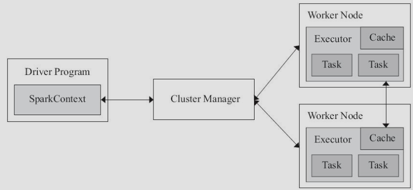

## Spark任务执行流程{#Spark任务执行流程}

&nbsp;　　Spark应用在集群中以独立进程集合的形式运行，接受用户Driver程序中main函数SparkContext对象的协调。
&nbsp;　　当任务提交到集群上，SparkContext可以与多种集群管理器(Standalone、Mesos、YARN)连接，这些集群管理器负责为应用分配资源。
&nbsp;　　一旦连接建立，Spark可以在集群节点上获得Executor，这些Executor进程负责执行计算和为应用程序存储数据。
&nbsp;　　接下来Spark会将应用程序代码发送给Executor。
&nbsp;　　最后，SparkContext将任务发送至Executor执行，如下图所示：

