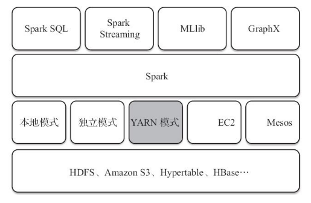
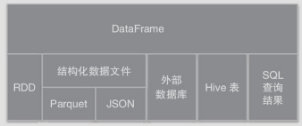
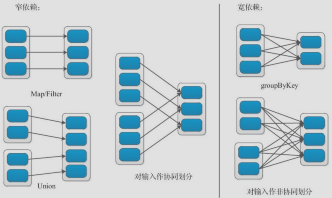
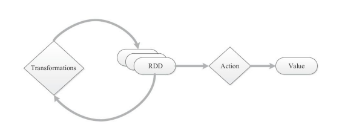
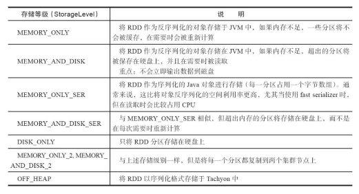

### Spark的重要扩展

> Spark的基础平台扩展了5个主要的Spark库，包括支持结构化数据的Spark SQL、处理实时数据的Spark Streaming、用于机器学习的MLib、用于图形计算的GraphX、用于统计分析的SparkR，各种程序库与Spark核心API高度整合在一起，并在不断改进。如下所示：  
>     

#### Spark SQL和DataFrame

* Spark SQL是Spark的一个处理结构化数据的模块，提供一个DataFrame编写抽象。它可以看作是一个分布式SQL查询引擎，主要由Catalys优化、Spark SQL内核、Hive支持三部分组成。
* DataFrame是以指定列组织的分布式数据集合，在Spark SQL中，相当于关系数据库的一个表，或R/Python的一个数据框架。
* DataFrames支持多种数据源构建，如下图所示：
  

#### Spark Streaming

* Spark Streaming属于核心Spark 的扩展，支持，高吞吐量和容错的实时流数据处理，它可以接受来自Kafka、Flume、Twitter、ZeroMQ或TCP SOcket的数据源，使用复杂的算法和高级功能来进行处理，如Map、Reduce、Join、Window等，处理的结果数据能够存入文件系统、数据库。

#### Spark MLib和ML

* MLib是Spark对常用机器学习算法的实现库。MLib支持4种最常见的机器学习问题：二元分类、回归、聚类和协同过滤以及一个底层的梯度下降优化基础算法。MLib也是基于RDD的。
* Spark的ML库基于DataFrame提供API
  #### GraphX
* GraphX是用于图和并行计算的新API。从上层来看，GraphX通过引入弹性分布式属性图扩展了Spark RDD。

#### SparkR

* SparkR是AMPLab发布的一个R开发包，为Spark提供了一个轻量的前端。SparkR提供了Spark中弹性分布式数据级\(RDD\)的API，用户可以在集群上通过R Shell交互运行job。

### Spark的基础概念

| 概念 | 说明 |
| :---: | :--- |
| Application | 建立在Spark上的用户应用程序，由一个Driver程序和集群上的Executor组成 |
| Application jar | 一个包含用户Spark应用程序的jar包。在某些情况下，包含应用程序的依赖包\(不包含运行是的Spark和Hadoop库\) |
| Driver program | 驱动程序，运行main函数并创建SparkContext的进程 |
| Cluster Manager | 管理集群资源的外部服务\(独立模式、Mesos、YARN\) |
| Deploy mode | 决定何处运行Driver进程的部署模式，分为Cluster和client两种模式 |
| Worker node | 集群中应用程序节点 |
| Executor | 应用程序在Worker节点上启动的进程，该进程执行任务并保持数据在内存或磁盘中 |
| Task | 被发送到某个Executor的一个工作单元 |
| Job | 作业，一个Job包含多个RDD及作用于相应RDD上的各种operation |
| Stage | 阶段，每个Job都会被分解为多个相互依赖的任务集合 |
| RDD | 弹性分布式数据集 |
| operation | 作用于RDD的各种操作，分为Transformation和Action |
| Partion | 数据分区，一个RDD中的数据可以被分为多个不同的分区 |
| DAG | 有向无环图，反映RDD之间的依赖关系 |
| Narrow dependency | 窄依赖 |
| Wide dependency | 宽依赖，子RDD对父RDD中的所有数据分区都有依赖 |
| Caching Management | 缓存管理，对RDD的中间结果进行缓存管理，以加快整体的处理速度 |

### RDD介绍
#### RDD特征
  > 简单的说，Spark的一些都是基于RDD的，RDD就是Spark输入的数据，作为输入数据的每隔RDD有5个特征，其中分区、一系列的依赖关系和函数是三个基本特征，优先位置和分区策略是可选特征。

* 分区
  * 有一个数据分区列表，能够将数据进行切分，切分后的数据能够进行并行计算，是数据集的原子组成部分。
* 函数
  * 计算每隔分片，得到一个可遍历的结果，用于说明在父RDD上执行何种计算。
* 依赖
  * 计算每个RDD对父RDD的依赖列表，源RDD没有依赖，通过依赖关系描述血统(lineage)
* 优先位置
  * 每一个分片的优先计算位置比如HDFS的Block所在的位置应该是优先计算的位置
* 分区策略
  * 描述分区模式和数据存放的位置，键-值(key-value)的RDD根据Hash进行分区，类似于MapReduce的Partioner接口，根据key来决定分配的位置。
  
#### RDD依赖
  > RDD的依赖的形式体现为两种，窄依赖和宽依赖，如下图所示：
  
  
    
* 窄依赖
  * 窄依赖是指父RDD的每一个分区最多一个子RDD的分区所引用。表现为一个父RDD的分区对于一个子RDD的分区或多个父RDD的分区对应于一个子RDD的分区。也就是说一个父RDD的一个分区不可能对应一个子RDD的多个分区。
  * 当子RDD的每隔分区依赖单个父分区时，分区结构不发生改变，如Map、flatMap；当子RDD依赖多个父分区时，分区结构发生变化，如Union。
* 宽依赖
  * 宽依赖是指子RDD的每隔分区都依赖于所有父RDD的所有分区或者多个分区。也就是说一个父RDD的一个分区对应一个子RDD的多个分区。
  * 当任务执行失败，宽依赖的再次执行设计多个父RDD，从而引发全部的再执行。为了规避着这点，Spark会保持Map阶段中间数据输出的持久，在机器发生故障的情况下，再次执行只需要回溯Mapper持续输出的相应分区，来获取中间数据。
* 依赖关系说明
  * 窄依赖的RDD可以通过相同的键进行联合分区，整个操作都可以在一个集群节点上进行，以流水线的方式计算所得父分区，不会造成网络之间数据混合。
  * 宽依赖RDD会涉及数据混合，宽依赖需要首先计算所有的父分区数据，然后在节点之间进行Shuffle。
  * 窄依赖能够有效进行失效节点恢复，重新计算丢失RDD分区的父分区，不同节点之间可以并行计算。而对于一个宽依赖关系的血统(lineage)图，单个节点失效可能导致这个RDD的所有祖先丢失部分分区，因而需要重新计算。
  > Shuffle执行固化操作以及采取Persist缓存策略，在可以固话点或者缓存 点重新计算。
  * 执行时，调度程序会检查依赖性的类型，将窄依赖的RDD划到一组处理当中，即Stage。宽依赖在一个执行中会跨越连续的Stage，同时需要现实指定多个子RDD分区。

#### RDD的创建
  > 由于Spark一切都是基于RDD的，除了可以直接从父RDD转换，还支持两种方式来创建RDD：
  
  1. 并行化一个程序中已经存在的集合(如：数组)
  2. 引用一个外部的文件存储系统（HDFS、HBase、Tachyon或者是任何一个支持Hadoop输入格式的数据源）中的数据

#### RDD操作
  1. RDD提供了一个抽象的分布式数据架构，不用担心底层的数据分布特征，而应用逻辑可以表达为一系列转换处理。
  2. 应用逻辑是以一系列转换(Transformation)和执行(Action)来表达的，转换在RDD之间制定处理的相互依赖关系，而执行制定输出的形式
    * 转换：是指该操作从已经存在的数据集上创建一个新的数据集，是数据集的逻辑操作，并没有计算。
    * 执行：是指该方法提交一个与前一个Action之间的所有转换组成的Job进行计算，Spark会根据Action将作业且切分多个Job。
    > 在默认的情况下，Spark所有的转换操作都是惰性的，不会立即计算，只会记下转换操作应用的一些基础数据集，其中可以有多个转换结果。转换只有在遇到一个Action的时候才会执行，如下图s所示：
    
    
  
  3. 每一个Job计算完成，其内部的所有RDD都会被清除，如果在下一个Job中有用到其他Job中的RDD，会引发该RDD的再次计算（为了避免这种情况，可以使用Persist(默认是Cache)方法“持久化”一个RDD到内存中，Spark也支持持久化到磁盘中，或者复制RDD到各个节点）

##### 控制操作
  > 控制操作主要包括故障恢复、数据持久性、以及移除数据。其中，缓存操作Cache/Persist是惰性的，在进行执行的时候才会执行，而Unpersist会直接将RDD持久化到磁盘或HDFS等路径。
  
  1. RDD故障恢复
    * 容错机制主要是采取检查点(checkpoint)机制和数据备份机制。故障恢复是主动检查，以及不同机器之间的数据复制实现。Spark针对故障恢复中需要跨集群网络来复制大量数据而采取不用方法
      * 处理时间有限的
      * 保持数据持久性是外部数据源的职责
        > Spark在执行期间发生数据丢失，会重新执行之前的步骤来恢复丢失的数据(不是丢弃是钱所有已完成的工作);如果其中一个RDD坏掉来了，RDD中有记录之前的依赖关系，且依赖关系中记录了算子和分区，此时只需要在执行一边父RDD相应的分区。
            
        > 宽依赖的再次执行涉及多个父RDD，从而引发全部的再执行。为了规避着这点，Spark会保持Map阶段中间数据输出的持久，在机器发生故障的情况下，再次执行只需要回溯Mapper持续输出的相应分区，来获取中间数据。
        
  2. RDD持久化
    > Spark的持久化是指在不用的转换操作之间，将过程的数据缓存在内存中，实现快速重用或者故障恢复。持久化分为主动持久化和自动持久化。
    
    * 主动持久化:主要的目标是RDD重用，从而实现快速处理，。
      * 持久化等级选择：通过一个StorageLevel对象传递给persist()方法进行确定的，cache()方法调用persist()默认级别MEMORY_ONLY。下图是持久化的等级：
      
      
  3. 选择存储等级
     *  MEMORY_ONLY 使用CPU的效率最高
     *　如果RDD不等与MEMORY_ONLY很好配合，建议使用MEMORY_ONLY_SER并选择一个快速序列化的库
     * 尽可能不要存储数据在硬盘，除非计算数据集的函数计算量特别大。否则重新计算一个分区的速度与从硬盘中读取的效率差不多。
     * 如果想拥有快速故障恢复能力，可以使用复制级别。
  4. 移除数据
    * RDD可以随意在RAM中进行缓存，目前缓存的粒度为RDD级别，只能缓存全部的RDD。
    * Spark自动监视每个节点上使用的情况，在集群中足够的内存时，Spark会根据存缓使用情况确定一个LRU（最近最少使用算法）的数据分区进行删除。
        
   
    
      
  
