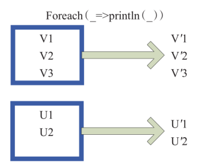
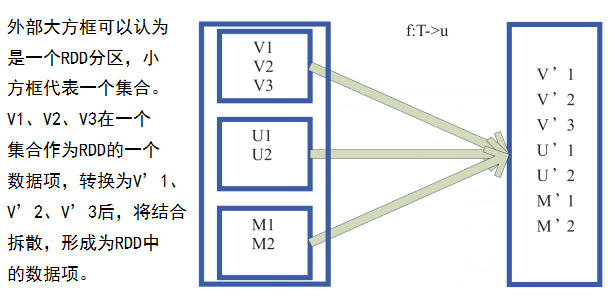
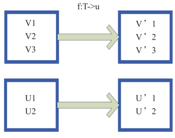
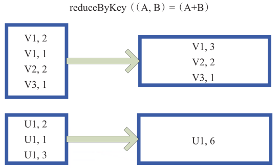

##  Spark编程中常用的API介绍

### collect
> 将分布式的RDD返回一个为单机的scala Array数组。在这个数组上运用scala的函数式操作。通过函数操作，将结果返回到Driver程序所在的节点，以数组形式存储。


### foreach
> 对RDD的每个元素都使用f函数操作。不返回RDD和Array，而是返回Unit。



### flatMap
> 将原来RDD中的每个元素通过函数f转换为新的元素，并将生成的RDD的每个集合中的元素合并为一个集合。内部创建为FlatMappedRDD(this, sc.clean(f))。



```scala
import org.apache.spark.{SparkConf, SparkContext}

object WordCount
{
def main(args: Array[String])
{
//SparkContext 的初始化需要一个 SparkConf 对象， SparkConf 包含了Spark集群配置的各种参数（比如主节点的URL）
val sc = new SparkContext("local", "testRDD") //Spark 程序的编写都是从 SparkContext 开始的。
var arr = sc.parallelize(Array(1, 2, 3, 4, 5)) //创建数据集
var result = arr.flatMap(x => List(x+1)).collect() //将整个数组转化为列表，列表中的内容为x+1
result.foreach(println)
}
}
```

运行结果为：
```
2
3
4
5
6
```

### map
> 将原来RDD的每个数据项通过map中自定义函数f映射转变为一个新的元素。源码中的map算子相当于初始化一个RDD，新RDD叫做MappedRDD(this, sc.clean(f))



```scala
import org.apache.spark.{SparkConf, SparkContext}

object WordCount
{
    def main(args: Array[String])
    {
          //SparkContext 的初始化需要一个 SparkConf 对象， SparkConf 包含了Spark集群配置的各种参数（比如主节点的URL）
          val sc = new SparkContext("local", "testRDD")   //Spark 程序的编写都是从 SparkContext 开始的。
          var arr = sc.parallelize(Array(1, 2, 3, 4, 5))  //创建数据集
          var result = arr.map(x => List(x+1)).collect()  //将每个元素转化为列表，列表中的内容为x+1
          result.foreach(println)
    }
}
```
运行结果为：
```
List(2)
List(3)
List(4)
List(5)
List(6)
```

### reduceByKey
> 将两个值合并为一个值



```scala
import org.apache.spark.{SparkConf, SparkContext}

object WordCount
{
  def main(args: Array[String])
  {
    //SparkContext 的初始化需要一个 SparkConf 对象， SparkConf 包含了Spark集群配置的各种参数（比如主节点的URL）
    val sc = new SparkContext("local", "testRDD")   //Spark 程序的编写都是从 SparkContext 开始的。
    var arr = sc.parallelize(Array(1, 1, 2, 2, 3))  //创建数据集
    var result = arr.map((_, 1)).collect()  //将元素转化为列表，列表中的内容为x+1
    result.foreach(println)
  }
}
```
运行结果如下所示：
```
(1,1)
(1,1)
(2,1)
(2,1)
(3,1)
```


```scala
import org.apache.spark.{SparkConf, SparkContext}

object WordCount
{
    def main(args: Array[String])
    {
          //SparkContext 的初始化需要一个 SparkConf 对象， SparkConf 包含了Spark集群配置的各种参数（比如主节点的URL）
          val sc = new SparkContext("local", "testRDD")   //Spark 程序的编写都是从 SparkContext 开始的。
          var arr = sc.parallelize(Array(1, 1, 2, 2, 3))  //创建数据集
          var result = arr.map((_, 1)).reduceByKey(_+_).collect()  //将元素转化为列表，列表中的内容为x+1
          result.foreach(println)
    }
}
```

运行结果如下所示：
```
(1,2)
(3,1)
(2,2)
```

```scala
import org.apache.spark.{SparkConf, SparkContext}

object WordCount
{
    def main(args: Array[String])
    {
          //SparkContext 的初始化需要一个 SparkConf 对象， SparkConf 包含了Spark集群配置的各种参数（比如主节点的URL）
          val conf = new SparkConf()
                    .setMaster("local")     //启动本地化计算
                    .setAppName("testRDD")  //设置本程序名称
          val sc = new SparkContext(conf)   //Spark 程序的编写都是从 SparkContext 开始的。
          //以上语句等价于  val sc = new SparkContext("local", "testRDD");
          val data = sc.textFile("c://wc.txt")  //读取文件
          data.flatMap(_.split(" "))         //下划线是占位符，flatMap是对行操作的方法，这里表示对读入的每个数据按空格进行分割
            .map((_, 1))                     //将每一项转化为key-value对，数据为key，1为value
            .reduceByKey(_+_)                //将具有相同key的项的value相加，合并成一个key-value对
            .collect()                       //将分布式的RDD返回为一个单机的Scala Array，在这个数组上运用scala的函数式操作
                                             //通过函数操作，将结果返回到Driver程序所在的节点，以数组形式存储
            .foreach(println)                //对每个元素println，打印
    }
}
```

运行结果如下所示：
```
(spark,2)
(hello,1)
(mo,1)
```