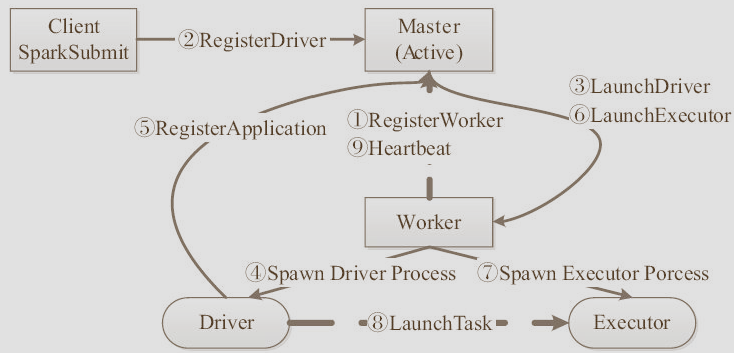

# 作业执行解析

## 基本概念{#基本概念}
&nbsp;　　 Spark的基本组件，包括负责集群运行的Master和Worker，负责集群资源管理器(如YARN)和执行单元Executor等，并在组件的基础上，对基于RDD数据集的静态视图和基于Partition的动态视图进行了说明，为接下来的作业执行流程铺垫。
### Spark组件{#Spark组件}
&nbsp;　　 在架构层面上，Spark Application都是由控制集群的主控节点Master、负责集群资源管理的Cluster Manager、执行具体任务的Worker节点和执行单元Executor、负责作业提交的Client端和负责作业的Driver进程组成。
&nbsp;　　 SparkClient负责任务的提交，Driver进程通过运行用户定义的main函数，在集群上执行何种并发和计算。其中，SparkContext是应用程序与集群交互的唯一通道，主要包括：获取数据、交互操作、分析和构建DAG图、通过Scheduler调度任务、Block跟踪、Shuffle跟踪。
&nbsp;　　 用户通过Client提交一个程序给Driver之后，Driver会将所有的RDD的依赖关联在一起绘制成一张DAG图；当运行任务时，调度Sheduler会配合组件Block Tracker和Shuffle Tracker进行工作；通过ClusterManager进行资源统一调度；具体任务在Worker节点进行，由Task线程池负责具体任务执行，线程池通过多个Task运行任务。
## 作业执行流程{#作业执行流程}
&nbsp;　　 提交作业有两种方式，分别是Driver运行在集群中，Driver运行在客户端，接下来分别介绍两种方式的作业运行原理。
&nbsp;　　 无论是基于哪种运行方式，基础概念是一致的。
      1. Stage,一个Spark作业一般包含一到多个Stage。
      2. Task，一个Stage包含一到多个Task，通过多个Task实现并行运行的功能。
      3. DAGScheduler，实现将Spark作业分解成一到多个Stage，每个Stage根据RDD的Partition个数决定Task的个数，然后生成相应的TaskSet放到TaskScheduler中。
### 基于Standalone模式的Spark架构{#基于Standalone模式的Spark架构}
&nbsp;　　在Standalone模式下有两种运行方式：**以Driver运行在Worker上** 和**以Driver运行在客户端**，在图中给出了Standalone模式下两种运行方式的架构。默认是Client模式（即Driver运行在客户端）。集群启动Master与Worker进程，Master负责接收客户端提交的作业，管理Worker，并提供Web展示集群与作业信息。

&nbsp;　　在整个框架下，各种进程角色如下：
* Master：主控节点，负责接受Client提交的作业，管理Worker，并命令Worker启动Driver和Executor。
* Worker：Slave节点上的守护进程，负责管理本届点的资源，定期向Master汇报心跳，接受Master的命令，启动Driver和Executor。
* client：客户端进程，负责提交作业到Master。
* Driver：一个Spark作业运行时包括一个Driver进程，也是作业的主进程，负责DAG图的构建、Stage的划分、Task的管理和调度以及生成ShedulerBackend用于Akka通信。主要组件包括DAGScheduler、TaskScheduler及SchedulerBackend。
* Executor：执行作业的地方。每个Application一般会对应多个Worker，但是一个Application在每个Worker上只会产生一个Executor进程，每隔Executor接收Driver的命令LanuchTask，一个Executor可以执行一到多个Task。
* 提交一个任务到集群，以Standalone为例，首先启动Master，然后启动Worker，启动Worker时要向Master注册。Standalone作业执行流程如下：

&nbsp;　　作业执行流程详细描述：
&nbsp;　　客户端提交作业给Master，Master让一个Worker启动Driver(即SchedulerBackend)。Worker创建一个DriverRunner线程，DriverRunner启动SchedulerBackend进程。另外，Master还会让其余Worker启动Executor（即ExecutorBackend）。Worker创建一个ExecutorRunner线程，ExecutorRunner会启动ExecutorBackend进程。ExecutorBackend启动后会向Driver的SchedulerBackend注册。SchedulerBackend进程包含DAGScheduler，它会根据用户程序生成执行计划，并调度执行。对于每个Stage的Task，都会被存放到TaskScheduler中。ExecutorBackend向SchedulerBackend汇报时把TaskScheduler中的Task调度到ExecutorBackend执行，把所有Stage都完成后作业结束。
&nbsp;　　程序执行过程中，由Worker节点向Master发送心跳，随时汇报Worker的健康状况。

