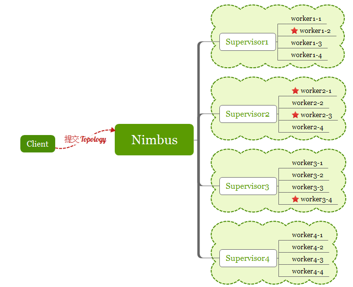
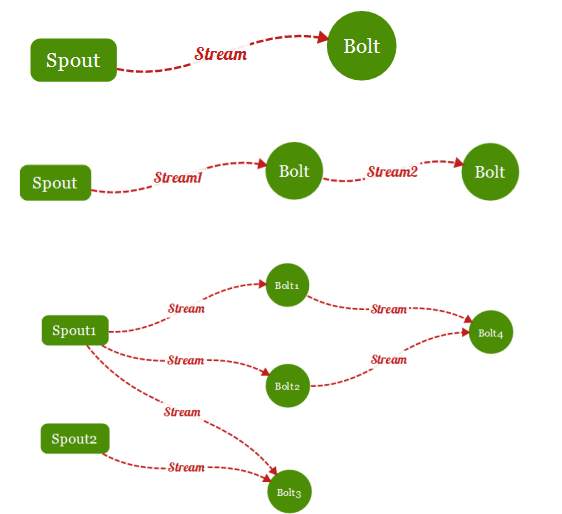

### Storm介绍

&nbsp;　　Storm是Twitter开源的分布式实时大数据处理框架，最早开源于github，从0.9.1版本之后，归于Apache社区，被业界称为实时版Hadoop。随着越来越多的场景对Hadoop的MapReduce高延迟无法容忍，比如网站统计、推荐系统、预警系统、金融系统(高频交易、股票)等等，大数据实时处理解决方案（流计算）的应用日趋广泛，目前已是分布式技术领域最新爆发点，而Storm更是流计算技术中的佼佼者和主流。

### Storm的核心组件
&nbsp;　　Nimbus：即Storm的Master，负责资源分配和任务调度。一个Storm集群只有一个Nimbus。

&nbsp;　　Supervisor：即Storm的Slave，负责接收Nimbus分配的任务，管理所有Worker，一个Supervisor节点中包含多个Worker进程。

&nbsp;　　Worker：工作进程，每个工作进程中都有多个Task。

&nbsp;　　Task：任务，在 Storm 集群中每个 Spout 和 Bolt 都由若干个任务（tasks）来执行。每个任务都与一个执行线程相对应。

&nbsp;　　Topology：计算拓扑，Storm 的拓扑是对实时计算应用逻辑的封装，它的作用与 MapReduce 的任务（Job）很相似，区别在于 MapReduce 的一个 Job 在得到结果之后总会结束，而拓扑会一直在集群中运行，直到你手动去终止它。拓扑还可以理解成由一系列通过数据流（Stream Grouping）相互关联的 Spout 和 Bolt 组成的的拓扑结构。

&nbsp;　　Stream：数据流（Streams）是 Storm 中最核心的抽象概念。一个数据流指的是在分布式环境中并行创建、处理的一组元组（tuple）的无界序列。数据流可以由一种能够表述数据流中元组的域（fields）的模式来定义。

&nbsp;　　Spout：数据源（Spout）是拓扑中数据流的来源。一般 Spout 会从一个外部的数据源读取元组然后将他们发送到拓扑中。根据需求的不同，Spout 既可以定义为可靠的数据源，也可以定义为不可靠的数据源。一个可靠的 Spout能够在它发送的元组处理失败时重新发送该元组，以确保所有的元组都能得到正确的处理；相对应的，不可靠的 Spout 就不会在元组发送之后对元组进行任何其他的处理。一个 Spout可以发送多个数据流。

&nbsp;　　Bolt：拓扑中所有的数据处理均是由 Bolt 完成的。通过数据过滤（filtering）、函数处理（functions）、聚合（aggregations）、联结（joins）、数据库交互等功能，Bolt 几乎能够完成任何一种数据处理需求。一个 Bolt 可以实现简单的数据流转换，而更复杂的数据流变换通常需要使用多个 Bolt 并通过多个步骤完成。

&nbsp;　　Stream grouping：为拓扑中的每个 Bolt 的确定输入数据流是定义一个拓扑的重要环节。数据流分组定义了在 Bolt 的不同任务（tasks）中划分数据流的方式。在 Storm 中有八种内置的数据流分组方式。
Reliability：可靠性。Storm 可以通过拓扑来确保每个发送的元组都能得到正确处理。通过跟踪由 Spout 发出的每个元组构成的元组树可以确定元组是否已经完成处理。每个拓扑都有一个“消息延时”参数，如果 Storm 在延时时间内没有检测到元组是否处理完成，就会将该元组标记为处理失败，并会在稍后重新发送该元组。
&nbsp;　　Storm程序再Storm集群中运行的示例图如下:

#### Topology
&nbsp;　　为什么把Topology单独提出来呢，因为Topology是我们开发程序主要的用的组件。

&nbsp;　　Topology和MapReduce很相像。MapReduce是Map进行获取数据，Reduce进行处理数据。而Topology则是使用Spout获取数据，Bolt来进行计算。总的来说就是一个Topology由一个或者多个的Spout和Bolt组成。

&nbsp;　　具体流程是怎么走，可以通过查看下面这张图来进行了解。示例图:

