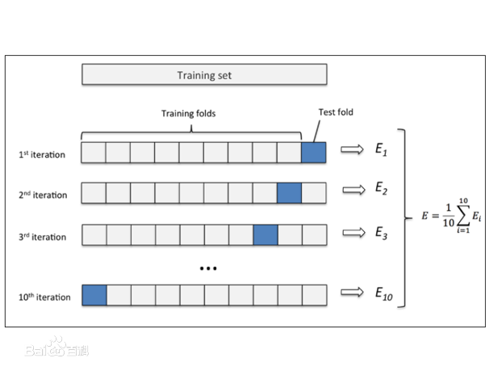

[otc]

### 模型评估与选择

#### 经验差与过拟合
##### 词语解释：
&nbsp;　　**误差**：把机器学习的实际预测输出与样本的真实输出之间的差异称之为"误差"
&nbsp;　　**训练误差（经验误差）**：学习器在训练集上的误差称之为"训练误差"
&nbsp;　　**泛化误差**：在新样本上的误差称之为"泛化误差"
&nbsp;　　**过拟合**：机器学习把训练样本学习得“太好了”的时候，很可能已经把训练训练样本本身的一些特征当做所有潜在样本都会具有的一般性质，这样导致泛化性能下降，这种现象称之为“过拟合”。（Demo：误以为树叶必须有锯齿）
&nbsp;　　**欠拟合**：与过拟合相对。（Demo：误以为绿色都是树叶）

#### 评估方法
&nbsp;　　需要通过实验测试对机器学习的泛化误差进行评估。需要一个“测试集”来测试机器学习对新样本的判别能力，“测试集”上的“测试误差”作为泛化误差的近似。其中，测试集应该与训练集互斥。

##### 留出法
&nbsp;　　**留出法**直接将数据集$$D$$划分为两个互斥的集合。其中一个作为训练集$$S$$，一个作为测试集$$T$$,即$$D=S \cup T, S \cap T = \emptyset$$。在$$S$$上训练模型后，用$$T$$来评估误差，作为泛化误差估计。
&nbsp;　　若训练集S包含绝大多数的样本，则训练出来的模型更接近于D训练出来的模型，由于T比较小，评估的结果可能不够稳定准确；若测试集T多包含一些样本，则训练集S与D差别更大，被评估的模型跟D训练出来的模型相比可能有较大的差别。最常见的做法是将大约$$2/3$$~$$4/5$$。

##### 交叉验证法
&nbsp;　　**交叉验证法**先将数据集$$D$$划分为$$k$$个大小相似的互斥子集，即$$D=D_1 \cup D_2 \cup ... \cup D_k, D_i \cap D_j= \emptyset (i \ne j)$$,每个子集$$D_i$$都尽可能保持数据分布一致性，即从$$D$$中通过分层采样得到。然后每次用$$k-1$$个自己的并集作为训练集，另外一个子集作为测试集。通常也把交叉验证法称为**k折交叉验证**如下图所示(10折交叉验证法)：

##### 自助法
&nbsp;　　给定包含$$m$$个个样本的的数据集$$D$$，我们对它进行采样产生数据集$$D$$,我们对它进行采样产生数据集$$$D_1$$:每次随即从D中挑选出一个样本，将其拷贝到D_1中(拷贝之后的数据还在原来集合D中，使得下次采样的时候还是可以被采到)；这个过程重复m次，得到了包含m个样本的的数据集D_1,这就是自助采样的结果。样本在m次的采样中始终不被采到的概率是$$(1 - \frac{1}{m})^m$$,取极限得到

$$\lim_{m\rightarrow \infty} (1 - \frac{1}{m}) \rightarrow \frac{1}{e} \approx 0.368$$
&nbsp;　　即通过自助采样，初始数据集D中约有36.8%的样本未出现在采样数据集D_1中。我们可以将D_1用作训练集，D\D_1作为测试集。
&nbsp;　　自助法在数据集较小、难以有效划分训练集/测试集时很有用。

#### 调参
&nbsp;　　大多数学习算法都有些参数(parameter) 需要设定，参数配置不同，学得模型的性能往往有显著差别，这就是通常所说的"参数调节"或简称"调参" (parameter tuning)。 

#### 性能度量
&nbsp;　　**性能度量**用于衡量模型泛化能力，在对比不同模型的能力时，使用不同的性能度量往往会导致不同的评判结果。

##### 错误率与精度

##### 查准率、查全率与F1

##### ORC与AUC

##### 代价敏感错误率与代价曲线