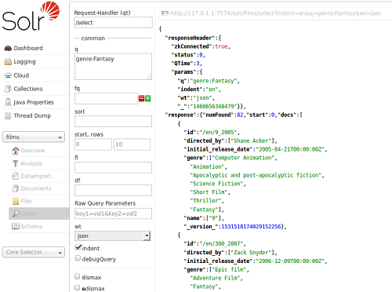

## Solr的web界面的说明

### Solr查询界面

* 您可以使用查询界面将搜索查询提交给 Solr 集合并分析结果。 
在下面截图中的例子中，查询已经被提交，并且界面显示了作为 JSON 形式发送到浏览器的查询结果。 

* 该响应显示在窗体的右侧。对 Solr 的请求只是简单的 HTTP 请求，而提交的查询在结果的上方以浅色显示；如果您点击它，它将打开一个新的浏览器窗口，只有这个请求和响应（没有 Solr 管理界面的其余部分）。其余的响应以 JSON 格式显示，这是默认的输出格式。

* 响应至少有两个部分，但可能还有其他几个部分，具体取决于所选的选项。它的两个部分始终是 responseHeader 和 response。responseHeader 包括搜索状态（status），处理时间（QTime）和参数（params 即用于处理查询）。

* response（响应）与查询匹配的文档，在 doc 小节中。字段返回取决于查询的参数（以及所使用的请求处理程序的默认值）。结果的数量也包括在本节中。

* 此屏幕允许您尝试使用不同的查询选项，并检查文档的索引方式。表单上可用的查询参数是大多数用户想要获得的一些基本选项，但是还有几十个可用的参数可以简单地添加到基本请求中（如果在浏览器中打开的话）。以下参数可用：

    * Request-handler（qt）：指定请求的查询处理程序。如果未指定查询处理程序，则 Solr 会使用标准查询处理程序处理响应。

    * q：查询事件。请参阅搜索此参数的说明。

    * FQ：筛选器查询。有关此参数的更多信息，请参阅常见查询参数。

    * sort：根据响应的分数或其他指定的特性，按升序或降序对查询进行响应排序。

    * start，rows：start是从哪个文档返回的查询结果的偏移量。默认值是 0，这意味着查询应返回从第一个匹配的文档开始的结果。该字段接受与搜索中描述的开始查询参数相同的语法。rows是要返回的行数。

    * FL：定义要为每个文档返回的字段。您可以通过用逗号或空格分隔列出您想要返回的存储字段、函数和 doc 转换器。

    * wt：指定用于格式化查询响应的响应书写器。如果未指定，则默认为 JSON。

    * indent：单击此按钮以请求响应编写器使用缩进使响应更具可读性。

    * debugQuery：点击这个按钮来增加带有调试信息的查询响应，包括返回的每个文档的“解释信息”。这个调试信息旨在让管理员或程序员理解。

    * dismax：单击此按钮启用 Dismax 查询解析器。有关更多信息，请参阅 DisMax Query Parser。

    * edismax：单击此按钮可启用扩展查询解析器。有关更多信息，请参阅扩展 DisMax 查询解析器。

    * HL：点击此按钮可以在查询响应中启用突出显示。请参阅突出显示了解更多信息。

    * facet：启用 facet，将搜索结果的排列方式设置为基于索引项的类别。有关详细信息，请参阅 facet。

    * spatial：点击以启用在空间或地理空间搜索中使用的位置数据。请参阅空间搜索以获取更多信息。

    * spellcheck：点击此按钮启用拼写检查程序，它根据其他类似的术语提供了内联查询建议。请参阅拼写检查以获取更多信息。